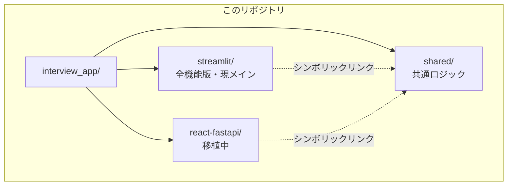

# 就活インタビューAI

ローカル LLM（Ollama）を使った就活支援アプリ。個人情報を外部に送信せず、**完全オフライン**で動作します。

---

## プロジェクト構成



| フォルダ | 説明 |
|---------|------|
| [`streamlit/`](./streamlit/) | Streamlit 版（全機能）← **現在のメイン** |
| [`react-fastapi/`](./react-fastapi/) | React + FastAPI 版（移植中） |
| [`shared/`](./shared/) | 両版が共有するエンジン・DB・プロンプト |

---

## 機能対応表

| 機能 | Streamlit版 | React+FastAPI版 |
|------|:-----------:|:---------------:|
| AI模擬面接 | ✅ | ✅ |
| 面接履歴 | ✅ | ✅ |
| ナレッジベース管理（RAG） | ✅ | ✅ |
| 設定 | ✅ | ✅ |
| 動的インタビュー・自己PR生成 | ✅ | 🔜 |
| 企業比較マトリクス | ✅ | 🔜 |
| 性格診断（Big Five） | ✅ | 🔜 |
| AIキャリアアドバイザー | ✅ | 🔜 |
| 想定質問生成 | ✅ | 🔜 |

---

## クイックスタート

### Streamlit版（全機能）

```bash
ollama pull qwen3:8b
ollama pull nomic-embed-text

cd streamlit
pip install -r requirements.txt
streamlit run app.py
# → http://localhost:8501
```

### React + FastAPI版（Docker）

```bash
cd react-fastapi

# 初回のみ：モデルをコンテナ内でセットアップ
docker compose --profile setup run --rm model_setup

# 起動
docker compose up --build
# → http://localhost:3000
```

---

## 共通仕様

| 項目 | 内容 |
|------|------|
| LLM | Ollama（ローカル） |
| 推奨チャットモデル | qwen3:8b |
| 推奨埋め込みモデル | nomic-embed-text |
| データ保存 | SQLite（ローカルのみ） |
| 外部送信 | **なし** |

---

## ドキュメント

- [Streamlit版 詳細README](./streamlit/README.md)
- [React+FastAPI版 詳細README](./react-fastapi/README.md)
- [React+FastAPI版 APIドキュメント](http://localhost:8000/docs)（起動後にアクセス）

---

## ライセンス

[MIT License](./LICENSE) © 2026 Myubd
