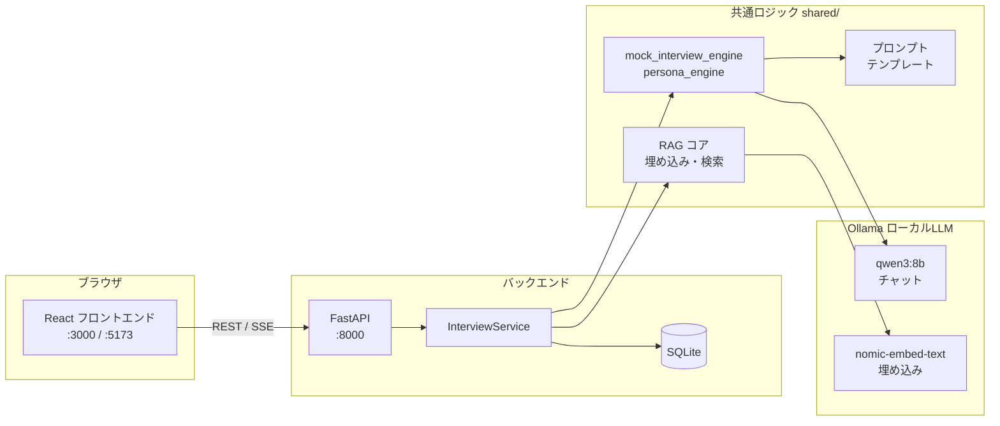
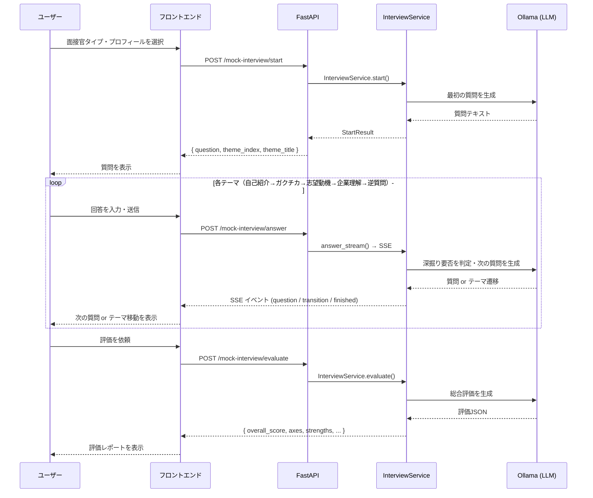
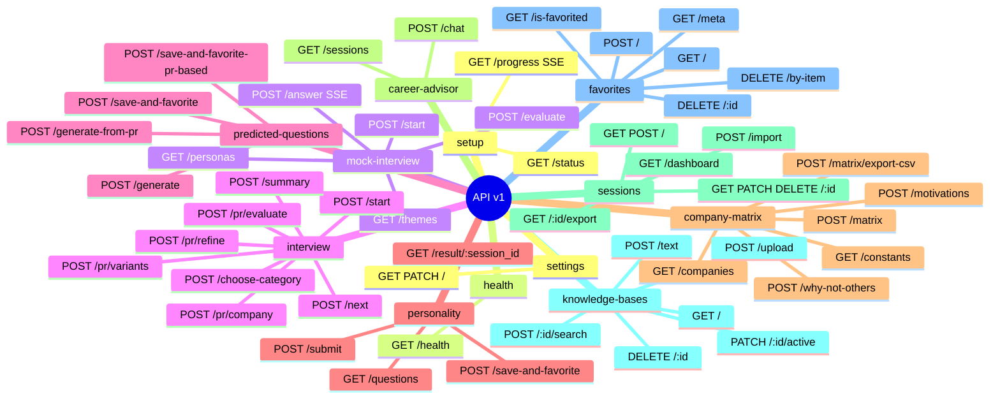

# 就活インタビューAI — React + FastAPI 版

Streamlit 版の主要機能を **React + FastAPI** に移植したプロジェクト。  
Docker で一発起動、または `start.sh` でローカル起動できます。

> 初回起動時はバックエンドが `GET /api/v1/setup/status` をポーリングし、Ollama・モデルのセットアップが完了するまで `SetupProgressPage` で進捗（SSE経由）を表示します。Ollama起動やモデルダウンロードに関するトラブルは[ルートREADMEのトラブルシューティング](../README.md#トラブルシューティング)を参照してください。

---

## アーキテクチャ概要



---

## 機能

| 機能 | 状態 |
|------|------|
| AI模擬面接 | ✅ |
| 自己PR作成（動的インタビュー） | ✅ |
| 想定質問生成 | ✅ |
| 性格診断（Big Five） | ✅ |
| 企業比較マトリクス | ✅ |
| AIキャリアアドバイザー | ✅ |
| 面接履歴 | ✅ |
| ダッシュボード（スコア集計） | ✅ |
| ナレッジベース管理（RAG） | ✅ |
| 設定 | ✅ |
| 初回セットアップ進捗表示 | ✅ |

> 全機能の移行が完了しています。Streamlit版からの移行過程・設計判断は [`shared/MIGRATION_GUIDE.md`](../shared/MIGRATION_GUIDE.md) を参照してください。

---

## セットアップ

### インストーラー版（推奨・Windows）

[Releases](../../../releases) からインストーラーをダウンロードして実行するだけです。  
**Ollama のインストール・起動、および LLM モデル（`qwen3:8b` / `nomic-embed-text`）の初回ダウンロードは、いずれもアプリ起動時に自動で行われます**（初回起動時にインターネット接続が必要です）。起動直後は `SetupProgressPage` にセットアップ進捗（Ollamaインストール状況・モデルダウンロード進捗）がリアルタイム表示され、完了後に自動でメイン画面へ遷移します。

> 自動ダウンロードに失敗した場合のみ、以下を手動実行してください。
>
> ```bash
> ollama pull qwen3:8b
> ollama pull nomic-embed-text
> ```

### 開発者向け（Docker・推奨）

```bash
cd react-fastapi

# 初回のみ：モデルをコンテナ内でセットアップ
docker compose --profile setup run --rm model_setup

# 起動
docker compose up --build
# → http://localhost:3000
```

### 開発者向け（ローカル起動）

```bash
cd react-fastapi
./start.sh

# フロントエンド: http://localhost:5173
# バックエンド API: http://localhost:8000/docs
```

#### バックエンドのみ

```bash
cd react-fastapi/backend
pip install -r requirements.txt
uvicorn main:app --reload --port 8000
```

#### フロントエンドのみ

```bash
cd react-fastapi/frontend
npm install
npm run dev
# → http://localhost:5173
```

---

## AI模擬面接フロー



---

## ディレクトリ構成

```
react-fastapi/
├── backend/
│   ├── main.py                    # FastAPI エントリポイント・CORS・ルーター登録
│   ├── api/routes/
│   │   ├── health.py               # GET /api/v1/health
│   │   ├── setup_progress.py       # GET /api/v1/setup/status, /progress (SSE)
│   │   ├── mock_interview.py       # /api/v1/mock-interview/* (SSE対応)
│   │   ├── interview.py            # /api/v1/interview/* （自己PR作成フロー）
│   │   ├── predicted_questions.py  # /api/v1/predicted-questions/*
│   │   ├── personality.py          # /api/v1/personality/* （性格診断）
│   │   ├── company_matrix.py       # /api/v1/company-matrix/* （企業比較マトリクス）
│   │   ├── career_advisor.py       # /api/v1/career-advisor/* （AIキャリアアドバイザー）
│   │   ├── sessions.py             # CRUD /api/v1/sessions/* + /dashboard
│   │   ├── knowledge_base.py       # /api/v1/knowledge-bases/*
│   │   ├── favorites.py            # /api/v1/favorites/*
│   │   ├── settings.py             # /api/v1/settings/
│   │   └── version.py              # GET /api/v1/version
│   ├── services/
│   │   ├── interview_service.py         # 模擬面接ビジネスロジック・SSEイベント生成
│   │   ├── interview_flow_service.py    # 自己PR作成フロー（テーマ制インタビュー）
│   │   ├── prediction_service.py        # 想定質問生成
│   │   ├── personality_service.py       # 性格診断
│   │   ├── company_matrix_service.py    # 企業比較マトリクス
│   │   ├── career_advisor_service.py    # AIキャリアアドバイザー（DB依存のコンテキスト構築）
│   │   └── rag_helpers.py               # RAG検索・会話履歴整形の共通ヘルパー
│   ├── llm/
│   │   ├── base.py                # LLMProvider 抽象クラス
│   │   ├── ollama_provider.py     # Ollama 実装（OpenAI/Claude スタブあり）
│   │   └── __init__.py            # DI 管理
│   ├── db/                        # SQLite データベース層（各種 repository）
│   ├── shared -> ../../shared/    # 共通モジュール（シンボリックリンク）
│   └── tests/
│       ├── test_unit.py
│       ├── test_api.py
│       └── test_integration.py
└── frontend/
    └── src/
        ├── api/client.ts              # 型付き REST API クライアント
        ├── hooks/
        │   ├── useMockInterview.ts    # 模擬面接状態管理・SSE ストリーミング
        │   └── useInterviewFlow.ts    # 自己PR作成フローの状態管理
        ├── components/
        │   ├── Sidebar.tsx            # ナビゲーション
        │   └── ui.tsx                 # Button / Card / Badge 等
        └── pages/
            ├── HomePage.tsx
            ├── SetupProgressPage.tsx      # 初回セットアップ進捗（SSE購読）
            ├── MockInterviewPage.tsx      # 設定→面接→評価の3フェーズ
            ├── InterviewPage.tsx          # 自己PR作成（動的インタビュー）
            ├── interview/                 # ↑の各セクション（プロフィール入力・チャット・PR生成 等）
            ├── PredictedQuestionsPage.tsx
            ├── PersonalityPage.tsx        # 性格診断（Big Five）
            ├── CompanyMatrixPage.tsx      # 企業比較マトリクス
            ├── CareerAdvisorPage.tsx      # AIキャリアアドバイザー
            ├── DashboardPage.tsx          # スコア集計ダッシュボード
            ├── HistoryPage.tsx
            ├── KnowledgePage.tsx
            └── SettingsPage.tsx
```

---

## API エンドポイント一覧



| Method | Path | 説明 |
|--------|------|------|
| GET | /api/v1/setup/status | 初回セットアップ状態確認（ポーリング用） |
| GET | /api/v1/setup/progress | 初回セットアップ進捗（**SSEストリーミング**） |
| GET | /api/v1/health | Ollama 疎通確認 |
| POST | /api/v1/mock-interview/start | 模擬面接開始・最初の質問取得 |
| POST | /api/v1/mock-interview/answer | 回答送信（**SSEストリーミング**） |
| POST | /api/v1/mock-interview/evaluate | 終了後評価生成 |
| GET | /api/v1/mock-interview/personas | ペルソナ一覧 |
| GET | /api/v1/mock-interview/themes | テーマ一覧 |
| POST | /api/v1/interview/start | 自己PR作成インタビュー開始 |
| POST | /api/v1/interview/next | 次の質問取得（テーマ制Q&A） |
| POST | /api/v1/interview/choose-category | カテゴリ選択 |
| POST | /api/v1/interview/summary | 面接サマリー生成 |
| POST | /api/v1/interview/pr/variants | 自己PR3パターン生成 |
| POST | /api/v1/interview/pr/evaluate | 自己PR評価 |
| POST | /api/v1/interview/pr/refine | 自己PR微調整リライト |
| POST | /api/v1/interview/pr/company | 企業別カスタマイズPR生成 |
| POST | /api/v1/predicted-questions/generate | 想定質問生成（企業KBベース） |
| POST | /api/v1/predicted-questions/generate-from-pr | 想定質問生成（自己PRベース） |
| POST | /api/v1/predicted-questions/save-and-favorite | 生成結果を保存＋お気に入り登録 |
| POST | /api/v1/predicted-questions/save-and-favorite-pr-based | 生成結果（自己PRベース）を保存＋お気に入り登録 |
| GET | /api/v1/personality/questions | 性格診断の設問一覧取得 |
| POST | /api/v1/personality/submit | 回答送信・AI診断結果生成 |
| POST | /api/v1/personality/save-and-favorite | 診断結果を保存＋お気に入り登録 |
| GET | /api/v1/personality/result/{session_id} | 保存済み診断結果取得 |
| GET | /api/v1/company-matrix/companies | 比較対象の企業KB一覧取得 |
| POST | /api/v1/company-matrix/motivations | 志望動機の一括生成 |
| POST | /api/v1/company-matrix/matrix | 比較マトリクス生成 |
| POST | /api/v1/company-matrix/why-not-others | 差別化ポイント生成 |
| GET | /api/v1/career-advisor/sessions | コンテキスト用の保存済みセッション一覧取得 |
| POST | /api/v1/career-advisor/chat | キャリア相談チャット応答生成 |
| GET / POST | /api/v1/sessions/ | セッション一覧・作成 |
| GET | /api/v1/sessions/dashboard | ダッシュボード用スコア集計データ取得 |
| GET / PATCH / DELETE | /api/v1/sessions/{id} | セッション取得・更新・削除 |
| GET | /api/v1/sessions/{id}/export | JSON エクスポート |
| POST | /api/v1/sessions/import | JSON インポート |
| GET | /api/v1/knowledge-bases/ | KB 一覧 |
| POST | /api/v1/knowledge-bases/text | テキストから KB 作成 |
| POST | /api/v1/knowledge-bases/upload | ファイルアップロードから KB 作成 |
| DELETE | /api/v1/knowledge-bases/{id} | KB 削除 |
| PATCH | /api/v1/knowledge-bases/{id}/active | アクティブ切り替え |
| POST | /api/v1/knowledge-bases/{id}/search | RAG 類似検索 |
| GET / POST | /api/v1/favorites/ | お気に入り一覧・追加 |
| DELETE | /api/v1/favorites/{id} | お気に入り削除 |
| GET | /api/v1/favorites/is-favorited | お気に入り登録済みか確認 |
| DELETE | /api/v1/favorites/by-item | 対象アイテム指定での削除 |
| GET / PATCH | /api/v1/settings/ | 設定取得・更新 |

全エンドポイントの詳細は起動後に http://localhost:8000/docs で確認できます。

---

## LLM プロバイダーの拡張

将来 OpenAI / Claude に切り替える場合は `backend/llm/ollama_provider.py` の
スタブを実装し、`backend/llm/__init__.py` の `get_provider()` を変更するだけで
全 API に反映されます。

```python
# llm/__init__.py
def get_provider() -> LLMProvider:
    return OllamaProvider()             # 現在
    # return OpenAIProvider(api_key=...) # 切り替え例
    # return ClaudeProvider(api_key=...) # 切り替え例
```

---

## テスト

```bash
cd react-fastapi/backend
pip install -r requirements.txt pytest httpx

# ユニット・APIテスト（外部依存なし）
pytest tests/ -m "not integration"

# 統合テスト（DB使用）
pytest tests/ -m "integration"

# Docker で実行
docker compose --profile test run --rm test
```
