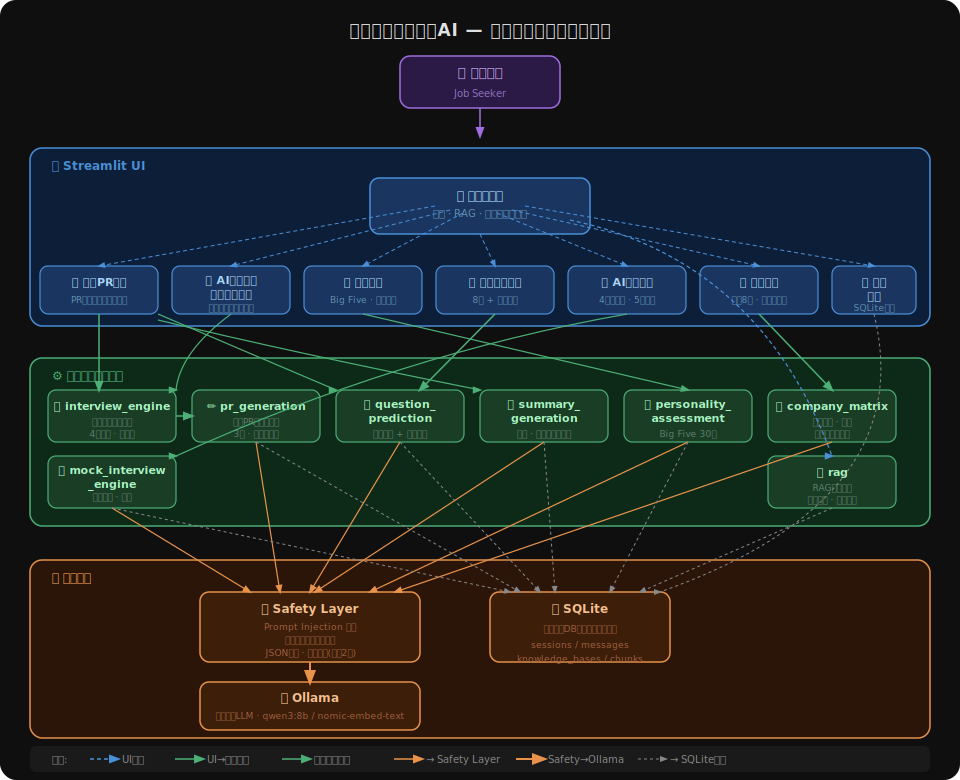

# 就活インタビューAI — Streamlit 版

Streamlit + ローカル LLM（Ollama）で動く就活支援アプリのメイン実装。  
個人情報を外部に送信せず、完全にオフラインで動作します。

---

## 機能一覧

| 機能 | 説明 |
|------|------|
| 動的インタビュー・自己PR生成 | 履歴書・企業情報をもとに面接対策コンテンツを生成 |
| AI模擬面接 | ペルソナ・業界別テーマで本番に近い面接を体験 |
| 企業比較マトリクス | 複数企業の特徴を表形式で比較 |
| 性格診断（Big Five） | 自己分析をサポート |
| AIキャリアアドバイザー | 志望方向・強みのアドバイスを生成 |
| 想定質問生成 | 企業・業界に合わせた予想質問を事前生成 |
| ナレッジベース管理（RAG） | 履歴書・企業情報をPDF/テキストで登録 |
| 面接履歴 | セッションをDBに保存・振り返り |

---

## セットアップ

### 前提条件

```bash
# Ollama をインストール後、モデルを取得（初回のみ）
ollama pull qwen3:8b
ollama pull nomic-embed-text
```

### 起動

```bash
cd streamlit
pip install -r requirements.txt
streamlit run app.py
# → http://localhost:8501
```

### 別マシンの Ollama に接続する場合

```bash
OLLAMA_HOST=http://192.168.1.10:11434 streamlit run app.py
```

---

## ディレクトリ構成

```
streamlit/
├── app.py                        # エントリポイント・ページルーティング
├── startup/                      # 起動フェーズ（DB初期化・Ollama確認）
├── state/                        # セッション状態の定義・初期化
├── components/sidebar/           # サイドバー UI
├── page_modules/                 # ページごとの UI ロジック
│   ├── interview/                # 動的インタビュー・自己PR生成
│   ├── mock_interview/           # AI模擬面接
│   ├── career_page.py            # AIキャリアアドバイザー
│   ├── company_matrix_page.py    # 企業比較マトリクス
│   ├── personality_page.py       # 性格診断（Big Five）
│   ├── predict_questions_page.py # 想定質問生成
│   └── history_page.py          # 面接履歴
├── utils/                        # LLM呼び出し・サニタイズ等のユーティリティ
├── rag/                          # RAGコアロジック（チャンク分割・埋め込み・検索）
├── db/                           # SQLiteデータベース層
├── session_io/                   # セッションのDB/JSON入出力
├── prompts/                      # プロンプトテンプレート
├── shared -> ../shared/          # streamlit/react-fastapi 共通モジュール（シンボリックリンク）
└── tests/                        # ユニット・統合テスト
```

---

## アーキテクチャ



---

## テスト

```bash
pip install -r requirements-dev.txt

# ユニットテスト（外部依存なし）
pytest tests/ -m "not integration"

# 統合テスト（DB使用）
pytest tests/ -m "integration"

# カバレッジ付き
pytest tests/ -m "not integration" --cov=utils --cov=rag --cov-report=term-missing
```

---

## 共通仕様

| 項目 | 内容 |
|------|------|
| LLM | Ollama（ローカル） |
| 推奨チャットモデル | qwen3:8b |
| 推奨埋め込みモデル | nomic-embed-text |
| データ保存 | SQLite（`db/career_support.db`） |
| 外部送信 | **なし** |
