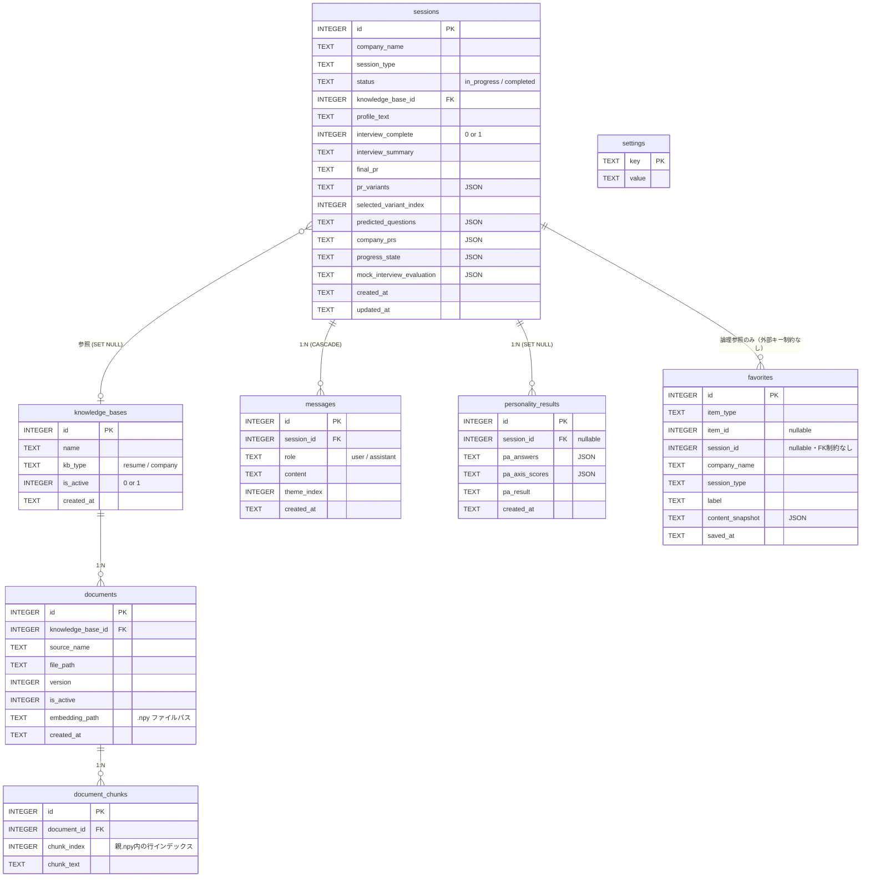

# db/

SQLite データベース層。スキーマ定義・接続管理・マイグレーションをまとめたパッケージです。

`career_support.db` はアプリ初回起動時に自動生成されます。手動で作成する必要はありません。

---

## ファイル構成

| ファイル | 役割 |
|---------|------|
| `database.py` | 接続管理・スキーマ初期化・マイグレーション実行 |
| `session_repository.py` | `sessions` / `messages` テーブルの CRUD |
| `knowledge_base_repository.py` | `knowledge_bases` / `documents` / `document_chunks` の CRUD |
| `personality_repository.py` | `personality_results` の CRUD |
| `settings_repository.py` | `settings` の取得・更新 |
| `__init__.py` | よく使う関数を一箇所からインポートできるようにまとめたエントリ |

---

## テーブル構成（ER図）



---

## 各テーブルの用途

### `knowledge_bases` / `documents` / `document_chunks`
RAG（検索拡張生成）用のナレッジベース。

- **knowledge_bases** — 「ソニー企業情報」「共通履歴書」などまとまり単位
- **documents** — KB内の個別ファイル。複数バージョン管理が可能（`version` / `is_active`）
- **document_chunks** — テキストをチャンク分割したもの。埋め込みベクトルは `embedding_path`（`.npy`）で参照

### `sessions` / `messages`
面接セッションと会話履歴。

- **sessions** — 会社・種別ごとのセッション。進行状態（`progress_state`）・評価結果（`mock_interview_evaluation`）・自己PR候補（`pr_variants` / `selected_variant_index`）・企業別自己PR（`company_prs`）はJSON列等に保持
- **messages** — `role: user / assistant` のチャット履歴。`theme_index` で模擬面接のテーマと紐付け

### `personality_results`
Big Five 性格診断の結果。セッションと紐付けることも、独立して保存することもできる（`session_id` は nullable）。

### `settings`
アプリ設定（チャットモデル名・埋め込みモデル名・Ollamaホスト等）のキーバリューストア。

### `favorites`
自己PR・模擬面接結果・質問セットなどのお気に入り保存。`item_type` / `item_id` で種別と対象を区別する。`session_id` は関連セッションへの参照だが、他テーブルと異なり外部キー制約は設定されていない（アプリ側でのみ整合性を担保）。

---

## 接続・使い方

```python
from db import db_session, init_db

# アプリ起動時に1回だけ呼ぶ
init_db()

# トランザクション付き接続（正常終了でcommit、例外でrollback）
with db_session() as conn:
    conn.execute("INSERT INTO sessions (company_name) VALUES (?)", ("ソニー",))

# テスト時はインメモリDBを使用
with db_session(":memory:") as conn:
    ...
```

DBパスは環境変数で上書き可能です。

```bash
INTERVIEW_DB_PATH=/path/to/custom.db streamlit run app.py
INTERVIEW_DB_PATH=:memory: pytest   # テスト用インメモリDB
```

---

## マイグレーション

新しいカラムが必要になったら `database.py` の `_MIGRATIONS` リストに追記するだけです。適用済みバージョンは `schema_migrations` テーブルで管理されるため、何度起動しても安全です。

```python
_MIGRATIONS: list[tuple[int, str]] = [
    (1, "ALTER TABLE sessions ADD COLUMN mock_interview_evaluation TEXT"),
    # 追記例:
    # (2, "ALTER TABLE sessions ADD COLUMN new_column TEXT"),
]
```

---

## バックアップ

```bash
# DB ファイルをそのままコピーするだけでバックアップできます
cp db/career_support.db db/career_support.db.bak
```

`career_support.db` 自体は `.gitignore` で除外されています。
